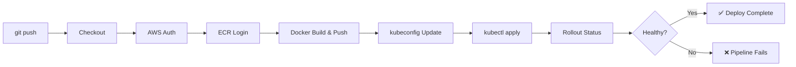

# 🚀 EKS CI/CD Pipeline — GitHub Actions → ECR → EKS


**A production-grade, fully automated CI/CD pipeline that builds, pushes, and deploys a containerized Node.js application to Amazon EKS on every `git push`.**

[Architecture](#-architecture) · [Quick Start](#-quick-start) · [Pipeline Walkthrough](#-pipeline-walkthrough) · [Deployment Demo](#-deployment-demo) · [Cleanup](#-cleanup)

---
 
## 📌 What This Project Demonstrates
 
This project showcases end-to-end DevOps engineering skills across the full deployment lifecycle:
 
| Skill | Technology |
|---|---|
| **Containerization** | Docker, multi-stage builds, Alpine base images |
| **Container Registry** | Amazon ECR — image tagging with git SHA |
| **Container Orchestration** | Amazon EKS, Kubernetes Deployments, Services, Rolling Updates |
| **CI/CD Automation** | GitHub Actions — build, push, deploy on every push to `main` |
| **Infrastructure Access** | IAM Users, Access Keys, EKS Access Entries, RBAC |
| **Zero-downtime Deploys** | Kubernetes rolling update strategy with rollout status gating |
| **GitOps Pattern** | Image placeholder replaced at deploy time — no hardcoded tags |
 
---
 
## 🏗 Architecture
 
```
┌──────────────┐      git push       ┌──────────────────┐
│  Developer   │ ──────────────────> │   GitHub Repo    │
│  Workstation │                     │   (main branch)  │
└──────────────┘                     └───────┬──────────┘
                                             │
                                             │ triggers workflow
                                             ▼
                                     ┌──────────────────┐
                                     │  GitHub Actions  │
                                     │                  │
                                     │  ① Checkout      │
                                     │  ② AWS Auth      │
                                     │  ③ ECR Login     │
                                     │  ④ Docker Build  │
                                     │  ⑤ ECR Push      │
                                     │  ⑥ kubectl Apply │
                                     │  ⑦ Rollout Wait  │
                                     └───────┬──────────┘
                                             │
                                ┌────────────┼────────────┐
                                │            │            │
                                ▼            ▼            ▼
                          ┌──────────┐ ┌──────────┐ ┌──────────┐
                          │   ECR    │ │   EKS    │ │   ELB    │
                          │  Image   │ │  Pods    │ │  :80     │
                          │ :git-sha │ │ Rolling  │ │  Public  │
                          └──────────┘ └──────────┘ └──────────┘
```
 
### Key Design Decisions
 
- **Image tagged with `github.sha`** — every build is uniquely identified and traceable back to an exact commit
- **`IMAGE_PLACEHOLDER` pattern** — Kubernetes manifests never contain hardcoded image tags; the pipeline injects the real URI at deploy time using `sed`
- **Rollout gating** — `kubectl rollout status --timeout=120s` ensures the pipeline fails fast if pods don't become healthy
- **Dedicated IAM user** — GitHub Actions uses least-privilege credentials scoped only to ECR and EKS operations
---
 
## 📋 Prerequisites
 
Before running this lab, ensure you have:
 
- [ ] AWS account with an existing EKS cluster
- [ ] `kubectl` configured and connected to your cluster
- [ ] AWS CLI configured (`aws sts get-caller-identity` returns your account)
- [ ] GitHub account
- [ ] `git` installed
---
 
## ⚡ Quick Start
 
### 1. Clone the repository
 
```bash
git clone https://github.com/<your-username>/eks-cicd-lab-<yourname>.git
cd eks-cicd-lab-<yourname>
```
 
### 2. Create AWS resources
 
```bash
# Create ECR repository
aws ecr create-repository \
  --repository-name cicd-app-<yourname> \
  --region us-east-1
 
# Create dedicated IAM user for GitHub Actions
aws iam create-user --user-name github-actions-deployer-<yourname>
 
# Attach ECR policy
aws iam attach-user-policy \
  --user-name github-actions-deployer-<yourname> \
  --policy-arn arn:aws:iam::aws:policy/AmazonEC2ContainerRegistryPowerUser
 
# Attach EKS describe policy
aws iam put-user-policy \
  --user-name github-actions-deployer-<yourname> \
  --policy-name eks-describe-cluster \
  --policy-document '{"Version":"2012-10-17","Statement":[{"Effect":"Allow","Action":"eks:DescribeCluster","Resource":"*"}]}'
 
# Generate access keys — save the output!
aws iam create-access-key --user-name github-actions-deployer-<yourname>
```
 
### 3. Grant IAM user access to EKS
 
```bash
aws eks create-access-entry \
  --cluster-name <your-cluster-name> \
  --principal-arn arn:aws:iam::<account-id>:user/github-actions-deployer-<yourname> \
  --type STANDARD
 
aws eks associate-access-policy \
  --cluster-name <your-cluster-name> \
  --principal-arn arn:aws:iam::<account-id>:user/github-actions-deployer-<yourname> \
  --policy-arn arn:aws:eks::aws:cluster-access-policy/AmazonEKSClusterAdminPolicy \
  --access-scope type=cluster
```
 
### 4. Add GitHub Secrets
 
Navigate to **Settings → Secrets and variables → Actions** in your repo and add:
 
| Secret | Description |
|---|---|
| `AWS_ACCESS_KEY_ID` | IAM user access key ID |
| `AWS_SECRET_ACCESS_KEY` | IAM user secret access key |
| `AWS_REGION` | `us-east-1` |
| `ECR_REPOSITORY` | `cicd-app-<yourname>` |
| `EKS_CLUSTER_NAME` | Your EKS cluster name |
 
### 5. Push and deploy
 
```bash
git add .
git commit -m "feat: initial CI/CD pipeline — version 1.0.0"
git push origin main
```
 
Watch the pipeline run live under the **Actions** tab in your GitHub repository.
 
---
 
## 🔁 Pipeline Walkthrough
 
The workflow defined in `.github/workflows/deploy.yaml` executes these steps on every push to `main`:
 
```yaml
① Checkout code          — pulls the latest commit into the runner
② Configure AWS creds    — authenticates using GitHub Secrets
③ Login to ECR           — obtains a temporary Docker login token
④ Build & push image     — builds Docker image, tags with git SHA, pushes to ECR
⑤ Update kubeconfig      — configures kubectl to talk to EKS
⑥ Deploy to EKS          — injects real image URI, applies manifests
⑦ Wait for rollout       — blocks until all pods are healthy (or fails pipeline)
```
 

 
---
 
## 🎬 Deployment Demo
 
### v1.0.0 — Initial Deploy
 
After the first pipeline run, get the application URL:
 
```bash
kubectl get svc cicd-app
```
 
```
NAME       TYPE           CLUSTER-IP      EXTERNAL-IP                    PORT(S)
cicd-app   LoadBalancer   10.100.x.x      <elb-hostname>.amazonaws.com   80:xxxxx/TCP
```
 
Open `http://<EXTERNAL-IP>` in your browser to see **Version 1.0.0** live.
 
---
 
### v2.0.0 — Zero-Downtime Rolling Update
 
Update `app.js`:
 
```javascript
const APP_VERSION = "2.0.0";   // bumped
const BG_COLOR    = "#0f3460"; // new color
```
 
Push the change:
 
```bash
git add app.js
git commit -m "feat: bump to v2.0.0 — new color scheme"
git push origin main
```
 
GitHub Actions automatically triggers, builds a new image tagged with the new commit SHA, and performs a **zero-downtime rolling update** on EKS. Refresh your browser — you'll see **Version 2.0.0** with the new background color, and a different pod hostname confirming new pods were rolled out.
 
---
 
## 📁 Project Structure
 
```
eks-cicd-lab-<yourname>/
│
├── app.js                          # Node.js web application
├── Dockerfile                      # Container definition (node:20-alpine)
│
├── k8s/
│   ├── deployment.yaml             # Kubernetes Deployment (2 replicas, rolling update)
│   └── service.yaml                # LoadBalancer Service (port 80 → 3000)
│
├── .github/
│   └── workflows/
│       └── deploy.yaml             # GitHub Actions CI/CD pipeline
│
└── README.md
```
 
---
 
## 🧹 Cleanup
 
Remove all AWS resources to avoid charges:
 
```bash
# Delete Kubernetes resources
kubectl delete -f k8s/service.yaml
kubectl delete -f k8s/deployment.yaml
 
# Delete ECR repository and all images
aws ecr delete-repository \
  --repository-name cicd-app-<yourname> \
  --region us-east-1 \
  --force
 
# Revoke IAM policies
aws iam detach-user-policy \
  --user-name github-actions-deployer-<yourname> \
  --policy-arn arn:aws:iam::aws:policy/AmazonEC2ContainerRegistryPowerUser
 
aws iam delete-user-policy \
  --user-name github-actions-deployer-<yourname> \
  --policy-name eks-describe-cluster
 
# Delete access keys
aws iam list-access-keys \
  --user-name github-actions-deployer-<yourname> \
  --query 'AccessKeyMetadata[].AccessKeyId' --output text | \
  xargs -I {} aws iam delete-access-key \
    --user-name github-actions-deployer-<yourname> \
    --access-key-id {}
 
# Delete IAM user
aws iam delete-user --user-name github-actions-deployer-<yourname>
 
# Delete EKS access entry
aws eks delete-access-entry \
  --cluster-name <your-cluster-name> \
  --principal-arn arn:aws:iam::<account-id>:user/github-actions-deployer-<yourname>
```
 
---
 
## 🏆 Bonus Challenges
 
| Challenge | Description | Skills Demonstrated |
|---|---|---|
| **Staging → Production** | Deploy to `staging` namespace first, require manual approval before `production` | GitOps, Environment Protection Rules |
| **Vulnerability Scanning** | Add `trivy` scan step — fail pipeline on CRITICAL findings | DevSecOps, Shift-Left Security |
| **OIDC Keyless Auth** | Replace IAM access keys with GitHub OIDC provider | Security Best Practices, IAM |
| **Slack Notifications** | Post deploy success/failure to a Slack channel | Observability, Alerting |
 
---
 
## 🛠 Tech Stack
 
| Layer | Technology |
|---|---|
| Application | Node.js 20, Alpine Linux |
| Containerization | Docker |
| Container Registry | Amazon ECR |
| Orchestration | Amazon EKS (Kubernetes 1.32) |
| CI/CD | GitHub Actions |
| Load Balancing | AWS ELB (Classic) |
| IAM | AWS IAM Users, Access Entries, RBAC |
| Infrastructure | AWS us-east-1 |
 
---
 
<div align="center">
Built with ❤️ by **Gerald** · [LinkedIn](https://linkedin.com) · [GitHub](https://github.com/goti13)
 
*This project was built as part of a hands-on DevOps engineering lab focusing on real-world CI/CD patterns used in production environments.*
 
</div>